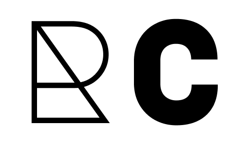

# RetroGlam Couture - Site de Moda Vintage e Glamour

Bem-vindo ao repositório do site "RetroGlam Couture". Este é um projeto fictício que demonstra como criar um site de moda vintage e glamour usando tecnologias como React, HTML, CSS e JavaScript.



## Visão Geral

O "RetroGlam Couture" é um site fictício que foi criado com o objetivo de reviver a elegância atemporal das décadas passadas e promover a moda vintage com um toque contemporâneo. Este projeto se concentra em várias tecnologias principais:

- React: Foi utilizado o framework React para criar uma experiência de usuário dinâmica e interativa. As páginas são construídas como componentes reutilizáveis.

- HTML: A estrutura do site é baseada em HTML para garantir uma marcação semântica e acessibilidade.

- CSS: O estilo do site é definido usando CSS, permitindo uma aparência elegante e única. Também valorizamos a responsividade, garantindo que o site seja adaptável a diferentes tamanhos de tela.

- JavaScript: Foi utilizado o JavaScript para tornar o site mais interativo, lidando com animações, validações de formulários e interações do usuário.

## Funcionalidades

- Explore nossa coleção de moda vintage e encontre peças únicas e autênticas.
- Saiba mais sobre nossa missão e compromisso com a sustentabilidade.
- Entre em contato conosco através do formulário de contato.
- Navegue pelas páginas com uma experiência suave e responsiva.

## Como Executar o Projeto

Para executar este projeto em seu ambiente local, siga estas etapas:

1. Clone este repositório para sua máquina:

   ```bash
   git clone https://github.com/seu-usuario/retroglam-couture.git

2. Navegue até o diretório do projeto:
    
    cd retroglam-couture
3. Instale as dependências do projeto:
    
    npm install
4. Inicie o servidor de desenvolvimento:
    
    npm start
5. Abra o seu navegador e acesse 
    http://localhost:3000 para visualizar o site.

## Contribuições
Ficaríamos felizes com contribuições para aprimorar este projeto, seja corrigindo bugs, adicionando novos recursos ou melhorando a aparência e a usabilidade. Sinta-se à vontade para abrir problemas (issues) e enviar solicitações de pull (pull requests).

## Licença
Este é um projeto fictício apenas para fins de demonstração. Não é para uso comercial. Consulte o arquivo [LICENSE][MIT] para mais detalhes.

Agradecemos por visitar o "RetroGlam Couture"! Esperamos que você tenha gostado de explorar o nosso projeto fictício e as tecnologias envolvidas.

